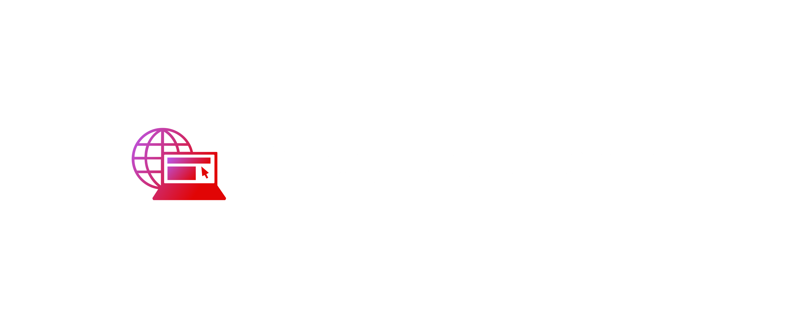

<h1 align="center">Hi there, I'm <a href='https://www.averymclaughlin.com'>Avery</a> 👋🏽 a full stack web developer</h1>

Software engineer with front and back-end development experience, QA testing, and network
infrastructure. I seek to use tech as a tool to enable positive change for others.

  See <a href='https://www.averymclaughlin.com/'>my website</a> for more info!

<h2 align='center'>Projects</h2>

<!--
<table bordercolor="#66b2b2">
  
  <tr>
    <td width="50%" valign="top">
      <h3 align="center">Travelara.org</h3>
         
        
         
        

          
    
  
      

        
<strong>Javascript, Bootstrap, Sass, Node.js, & Express.js</strong> - Platform to help build momentous milestones along with your friends and family! Travelara makes Dream Trips a Reality!

    </td>
    <td width="50%" valign="top">
      <h3 align="center">Rigley 2: "Flappy Bug"</h3>
         
      
         
        

          
  
  
      

        
<strong>Javascript & Phaser.js</strong> - The awaited sequel sees our Rigley friend jumping through firewalls "Flappy Bird" style.

    </td>
  </tr>
  
  <tr>
    <td width="50%" valign="top">
      <h3 align="center">AveryMcLaughlin.com</h3>
       
        
       
        

  
  
      

        
<strong>HTML5, CSS3, & Javascript</strong> - Portfolio Site including links to my projects and ways to get in contact with me.

    </td>
    <td width="50%" valign="top">
      <h3 align="center">Matching Cards</h3>
         
        
         
        

          
  
  
      

        
<strong>HTML5, CSS3, & Javascript</strong> - With over 100 different cards, test your memory in these three popular trading card themes, Pokemon, Yugioh, & Magic: The Gathering!

    </td>
  </tr>
</table>
>
<!--
**averymc-dev/averymc-dev** is a ✨ _special_ ✨ repository because its `README.md` (this file) appears on your GitHub profile.

Here are some ideas to get you started:

- 🔭 I’m currently working on ...
- 🌱 I’m currently learning ...
- 👯 I’m looking to collaborate on ...
- 🤔 I’m looking for help with ...
- 💬 Ask me about ...
- 📫 How to reach me: ...
- 😄 Pronouns: ...
- ⚡ Fun fact: ...
-->
